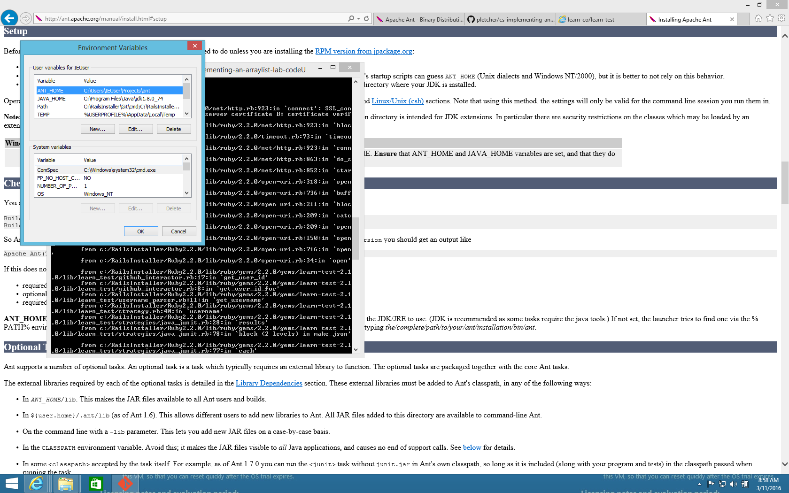

Installing the Learn Gem and a Java Environment on Windows (version >= 8)
---

Step 1: Install Linux.

Just kidding. Below are step-by-step instructions for getting up and running,
you crazy masochist.

1. Install Ruby (you'll need this to interact with the Learn platform)
   1. Download the [Windows - Ruby 2.2](http://railsinstaller.org/en) Rails Installer
   
   2. Run the installer. It should finish without a hitch.
   3. You can verify the installation by opening the newly installed [Git Bash](https://git-for-windows.github.io/) program.
   4. Be sure to add your SSH key (which should have been automatically copied to your clipboard) to your GitHub account.
   5. You can make sure that everything works by cloning this repo over SSH.
2. Set up your SSL certificates
   1. Open PowerShell (it should be installed on your system by default).
   2. Enter `Invoke-WebRequest http://curl.haxx.se/ca/cacert.pem -OutFile C:\RailsInstaller\cacert.pem` at the command prompt
   3. Update your environment variables
      1. Find the Environment Variables dialogue (it's somewhere under Control Panel, but you can also just search for it).
      
      2. Add a variable called `SSL_CERT_FILE` that points to `C:\RailsInstaller\cacert.pem`.
      3. Keep this dialogue open. You'll need it for a few more steps.
3. Install the appropriate [JDK8](http://www.oracle.com/technetwork/java/javase/downloads/jdk8-downloads-2133151.html) for your system.
   1. Add an environment variable (you did keep the dialogue open, right?) called `JAVA_HOME` that points to your installed JDK. (It should point to something like `C:\Program Files\Java\jdk1.8.0_74`.)
   2. Edit your `Path` (or `PATH`) environment variable. This is a semicolon-separated list of locations where the command prompt will attempt to find executables. You'll want to add `JAVA_HOME` to the end: `C:\path\already\set;%JAVA_HOME%`.
4. Download and unzip [Ant](http://ant.apache.org/bindownload.cgi). (Just download the `zip`'d binary version.)
   1. Unzip the archive to a directory that you'll remember (maybe `C:\Program Files\Ant`).
   2. Add an environment variable called `ANT_HOME` that points to the unarchived directory.
   3. Edit your `Path` environment variable so that it includes `%ANT_HOME%\bin`.
5. Install `learn-test`
   1. In a directory where you'd like to install external libraries (maybe `C:\Program Files\learn`?), clone [learn-test](https://github.com/learn-co/learn-test): `git clone git@github.com:learn-co/learn-test.git`
   2. Enter the `learn-test` directory (`cd learn-test`) and build the gem: `gem build learn-test.gemspec`.
   3. Install the gem: `gem install learn-test-x.x.x.gem` (where `x.x.x` is the version that you've installed).
   4. Now when you're ready to check the results of a lab, you can run `learn-test` from the lab's directory.

 From here on out, whenever a lab or README asks you to open a terminal, you'll want to open Git Bash. You can just search for it using Windows' search feature and it should show up.

 

That's it! You should now be able to run `learn` in any of the labs and observe your progress on Learn.co. Happy coding!
